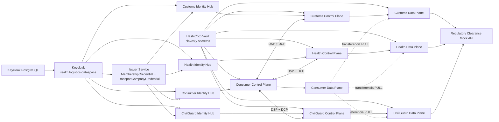

# Puerto Dataspace EDC

Prototipo de Espacio de Datos portuario construido con Eclipse Dataspace
Components (EDC), Dataspace Protocol (DSP) y Decentralized Claims Protocol
(DCP).

## Modo servicio local

El proyecto puede arrancarse como servicio demostrador local mediante Docker
Compose. Este modo levanta infraestructura, stack EDC y la UI Streamlit.

### Arranque

```powershell
powershell.exe -NoProfile -ExecutionPolicy Bypass -File .\scripts\service-start.ps1
```

Equivalente manual:

```powershell
docker compose -f .\docker-compose.infra.yml -f .\docker-compose.edc.yml -f .\docker-compose.service.yml up -d --build
```

### URLs

- UI Streamlit: http://localhost:8501
- Keycloak: http://localhost:8080
- Vault: http://localhost:8200
- Mock API: http://localhost:8081

Si el puerto `8501` ya esta ocupado, cambia `UI_PORT` en `.env`, por ejemplo
`UI_PORT=8502`.

### Ejecutar flujo completo

```powershell
powershell.exe -NoProfile -ExecutionPolicy Bypass -File .\start-edc-and-smoke-three-providers.ps1
```

Con la API orquestadora local activa, la UI Docker tambien puede lanzar este
flujo desde sus botones.

### Estado

```powershell
powershell.exe -NoProfile -ExecutionPolicy Bypass -File .\scripts\service-status.ps1
```

### Logs

```powershell
powershell.exe -NoProfile -ExecutionPolicy Bypass -File .\scripts\service-logs.ps1 ui
powershell.exe -NoProfile -ExecutionPolicy Bypass -File .\scripts\service-logs.ps1 consumer-controlplane
```

### Parada

```powershell
powershell.exe -NoProfile -ExecutionPolicy Bypass -File .\scripts\service-stop.ps1
```

Este comando conserva volumenes. No usar `down -v` salvo que se quiera borrar
el estado persistido.

> Este modo es un servicio demostrador local, no un despliegue productivo.
> Vault esta en modo dev, Keycloak usa configuracion de demo y los participantes
> se ejecutan en una misma maquina.

Consulta tambien [`SERVICIO.md`](SERVICIO.md) para ver el contrato operativo:
comandos, endpoints, artefactos de salida y criterio de servicio listo.

## API orquestadora local

Cuando la UI se ejecuta dentro de Docker, no puede ejecutar directamente
PowerShell ni Docker del host. Para habilitar los botones de ejecucion se usa una
API orquestadora local que corre en Windows y solo permite comandos predefinidos.
El código, README y dependencias de esta API estan en `orchestrator_api/`.

### Arranque recomendado

```powershell
powershell.exe -NoProfile -ExecutionPolicy Bypass -File .\scripts\orchestrator-start.ps1 -Background
powershell.exe -NoProfile -ExecutionPolicy Bypass -File .\scripts\service-start.ps1
```

Tambien puedes arrancar el orquestador en primer plano en una terminal separada:

```powershell
powershell.exe -NoProfile -ExecutionPolicy Bypass -File .\scripts\orchestrator-start.ps1
```

### Parada del orquestador

```powershell
powershell.exe -NoProfile -ExecutionPolicy Bypass -File .\scripts\orchestrator-stop.ps1
```

### Conflicto con Vault

Si Docker indica que ya existe un contenedor `vault`, libera ese nombre y vuelve
a arrancar:

```powershell
docker stop vault
docker rm vault
powershell.exe -NoProfile -ExecutionPolicy Bypass -File .\scripts\service-start.ps1
```

No uses `docker compose down -v` salvo que quieras borrar volumenes.

### Conflicto con puerto 8765

Si el puerto `8765` esta ocupado, comprueba si ya es el orquestador:

```powershell
Invoke-RestMethod http://localhost:8765/health
```

Si responde, el orquestador ya esta activo y no hace falta arrancarlo otra vez.

### Abrir UI

```text
http://localhost:8501
```

Si `8501` esta ocupado, configurar `UI_PORT` en `.env`.

Con el orquestador activo, la UI puede lanzar:

- Arrancar EDC sin smoke.
- Ejecutar demo completa.
- Ejecutar solo smoke test.

La UI muestra el estado de disponibilidad del orquestador y una tabla de runs.
No muestra el log completo del run en pantalla; los logs se conservan en
`resources/generated/orchestrator-runs/`.

La API escucha por defecto en:

```text
http://localhost:8765
```

Desde Docker, la UI accede al host mediante:

```text
http://host.docker.internal:8765
```

Este mecanismo es solo para entorno local de demo.

Las páginas de flujo manual y provisioning funcionan tanto en Streamlit local
como en la UI Docker, adaptando automáticamente las URLs `localhost`,
`host.docker.internal` y servicios Compose.

El orquestador solo acepta comandos de lista blanca y no permite ejecutar
comandos arbitrarios desde HTTP.

El proyecto representa la autorización de retirada de un contenedor. Un Consumer,
que actúa como empresa transportista, consulta y combina información procedente
de tres Providers:

- **Customs**: autorización aduanera.
- **Health**: inspección sanitaria.
- **CivilGuard**: autorización de Guardia Civil.

El contenedor queda disponible para su retirada únicamente cuando los tres
Providers responden con estado `CLEARED`.

## Arquitectura



Cada participante dispone de un Control Plane, un Data Plane y un Identity Hub
con PostgreSQL independiente. El Issuer Service emite una
`MembershipCredential` para cada participante y una
`TransportCompanyCredential` para el Consumer. Durante catálogo, negociación y
transferencia, DCP utiliza esas credenciales para autenticar y autorizar a las
contrapartes.

## Infraestructura base

La infraestructura común está definida en
[`docker-compose.infra.yml`](docker-compose.infra.yml). Este compose levanta:

- `keycloak-postgres`: base de datos PostgreSQL de Keycloak.
- `keycloak`: servidor Keycloak accesible en `http://localhost:8080`.
- `vault`: HashiCorp Vault en modo desarrollo, accesible en
  `http://localhost:8200`, con token `root`.

Keycloak usa PostgreSQL y arranca con import automático del realm:

```yaml
command: start-dev --import-realm
volumes:
  - ./infra/keycloak/import:/opt/keycloak/data/import
```

El fichero importado es
[`infra/keycloak/import/realm-export.json`](infra/keycloak/import/realm-export.json)
y contiene el realm `logistics-dataspace` con los clients, client scopes,
asociaciones de scopes, roles y secrets de demo necesarios para Identity Hub e
Issuer Service.

Para un usuario nuevo, basta con arrancar la infraestructura desde la raíz del
repositorio:

```powershell
docker compose -f .\docker-compose.infra.yml up -d
```

Para levantar infraestructura y servicios EDC en una sola orden:

```powershell
docker compose -f .\docker-compose.infra.yml -f .\docker-compose.edc.yml up -d
```

> Importante: no ejecutes `docker compose down -v` si quieres conservar datos.
> La opción `-v` elimina volúmenes, incluido el PostgreSQL de Keycloak y las
> bases de datos del proyecto.

## Participantes

| Participante | DID | Asset |
|---|---|---|
| Consumer | `did:web:consumer-identityhub%3A7083:consumer` | Consume y agrega los tres resultados |
| Customs | `did:web:provider-identityhub%3A8183:provider` | `asset-clearance-mscu7654321` |
| Health | `did:web:health-identityhub%3A8183:health` | `asset-health-clearance-mscu7654321` |
| CivilGuard | `did:web:civilguard-identityhub%3A8183:civilguard` | `asset-civilguard-clearance-mscu7654321` |
| Issuer | `did:web:issuer-service%3A10016:issuer` | Emite `MembershipCredential` y `TransportCompanyCredential` |

## Puertos principales

| Stack | Identity Hub | Management API | DSP | Control API | Data Plane público | PostgreSQL |
|---|---:|---:|---:|---:|---:|---:|
| Consumer | `7280-7284` | `29193` | `29292` | `29194` | `29294` | `7433` |
| Customs | `7180-7184` | `19193` | `19292` | `19194` | `19294` | `7432` |
| Health | `7380-7384` | `21193` | `21292` | `21194` | `21294` | `7434` |
| CivilGuard | `7480-7484` | `22193` | `22292` | `22194` | `22294` | `7435` |

Otros servicios:

| Servicio | Puertos |
|---|---|
| Regulatory Clearance Mock API | `8081` |
| Keycloak | `8080` |
| Keycloak PostgreSQL | `5432` |
| HashiCorp Vault | `8200` |
| Issuer Service | `10010`, `10011`, `10012`, `10013`, `10015`, `10016`, `9999` |
| Issuer PostgreSQL | `7444` |

La infraestructura común está en
[`docker-compose.infra.yml`](docker-compose.infra.yml). Los componentes EDC,
Identity Hub, Issuer Service, Mock API y PostgreSQL propios del proyecto están en
[`docker-compose.edc.yml`](docker-compose.edc.yml).
La UI Docker del modo servicio está en
[`docker-compose.service.yml`](docker-compose.service.yml).

## Usage Policy actual

En el flujo completo, el Consumer solo puede consultar el estado del contenedor
si cumple todas estas condiciones:

- Está autenticado vía DCP frente al Provider.
- Tiene una `MembershipCredential` activa emitida por el Issuer Service.
- Tiene una `TransportCompanyCredential` con `role = TransportCompany`.
- Demuestra una orden de transporte activa para el `containerId` del asset.

El `containerId` se resuelve desde las propiedades del asset. Para la demo, el
contenedor principal es:

```text
MSCU7654321
```

La validación de orden activa se realiza contra el Mock API de regulatory
clearance, que expone datos de demostración para el transportista del Consumer.

Si se consulta un contenedor que no está precargado pero cuyo identificador es
válido (`4 letras + 7 digitos`, por ejemplo `TESU1111111`), la Mock API devuelve
respuestas sintéticas `CLEARED` para Customs, Health y CivilGuard, y valida una
orden de transporte activa de demo. Los identificadores con formato inválido se
rechazan con HTTP `400`.

## Requisitos

- Windows con Docker Desktop en ejecución.
- Windows PowerShell 5.1 o PowerShell 7.
- Puertos de las tablas anteriores disponibles.
- Imágenes locales del proyecto:

  - `puerto-edc-controlplane:latest`
  - `puerto-edc-dataplane:latest`
  - `puerto-identityhub-mvd:latest`
  - `puerto-issuerservice-mvd:latest`

El realm de Keycloak se importa desde
`infra/keycloak/import/realm-export.json` al arrancar
`docker-compose.infra.yml`. El script de validación crea o repara en Vault las
claves privadas de participantes y las claves `private-key` y `public-key` del
Transfer Proxy cuando no existen. No construye todas las imágenes personalizadas
desde cero, salvo la imagen del Control Plane durante el flujo principal.

Para comprobar rápidamente las dependencias principales:

```powershell
docker image inspect puerto-edc-controlplane:latest | Out-Null
docker image inspect puerto-edc-dataplane:latest | Out-Null
docker image inspect puerto-identityhub-mvd:latest | Out-Null
docker image inspect puerto-issuerservice-mvd:latest | Out-Null

Invoke-WebRequest -UseBasicParsing http://localhost:8200/v1/sys/health
Invoke-WebRequest -UseBasicParsing http://localhost:8080/realms/logistics-dataspace
```

## Arranque recomendado

Desde la raíz del repositorio, arranca primero Keycloak, PostgreSQL de Keycloak
y Vault:

```powershell
docker compose -f .\docker-compose.infra.yml up -d
```

Después ejecuta el flujo completo de provisionado y smoke test:

```powershell
powershell.exe -NoProfile -ExecutionPolicy Bypass -File .\start-edc-and-smoke-three-providers.ps1
```

Si quieres dejar el entorno arrancado y provisionado sin ejecutar el smoke test:

```powershell
powershell.exe -NoProfile -ExecutionPolicy Bypass -File .\start-edc-three-providers.ps1
```

Este es el comando principal de validación del proyecto. El script
[`start-edc-and-smoke-three-providers.ps1`](start-edc-and-smoke-three-providers.ps1)
realiza automáticamente:

1. Arranque de PostgreSQL de Identity Hubs, PostgreSQL de Issuer Service,
   Identity Hubs, Issuer Service y Mock API.
2. Espera activa hasta que los Identity Hubs y el Issuer Service estén
   disponibles.
3. Obtención de tokens OAuth2 desde Keycloak usando el realm
   `logistics-dataspace`.
4. Activación y, si hace falta, reprovisionado de los participantes.
5. Emisión de las `MembershipCredential` que falten.
6. Registro y emisión de la `TransportCompanyCredential` del Consumer.
7. Construcción de la imagen `puerto-edc-controlplane:latest`.
8. Arranque o recreación de todos los Control Planes y Data Planes.
9. Provisión de las claves del Transfer Proxy en Vault.
10. Registro de assets, policies y contract definitions en los tres Providers.
11. Comprobación de que los tres Data Planes estan `AVAILABLE`.
12. Ejecución de
    [`smoke-test-three-providers.ps1`](smoke-test-three-providers.ps1).

El smoke test solicita los tres catálogos, negocia tres contratos, inicia tres
transferencias `HttpData-PULL`, descarga los datos y genera el resultado
agregado.

Una ejecución correcta termina con:

```text
OK: flujo multi-provider validado
ENTORNO MULTI-PROVIDER VALIDADO
```

El resultado esperado para los datos de demostración es:

```json
{
  "containerId": "MSCU7654321",
  "customsStatus": "CLEARED",
  "healthInspectionStatus": "CLEARED",
  "civilGuardStatus": "CLEARED",
  "overallStatus": "READY_FOR_PICKUP",
  "blockingAuthorities": []
}
```

## Resultados generados

Los artefactos de ejecución se escriben en `resources/generated/`:

- `catalog-*-response.json`: catálogos recibidos.
- `contract-negotiation-request-*.json`: solicitudes de negociación.
- `transfer-request-*.json`: solicitudes de transferencia.
- `edr-*-response.json`: Endpoint Data References.
- `downloaded-*-clearance.json`: datos descargados de cada Provider.
- `aggregated-clearance-status.json`: resultado final consolidado.
- `orchestrator-runs/*.json`: metadatos de runs lanzados por la API orquestadora.
- `orchestrator-runs/*.log`: logs de runs lanzados por la API orquestadora.

## Interfaz visual

El proyecto incluye un dashboard local en Streamlit para seguir visualmente el
flujo del script principal, el arranque sin smoke test y la validación
multi-provider.

Instalación:

```powershell
python -m venv .venv
.\.venv\Scripts\python.exe -m pip install -r .\ui\requirements.txt
```

Ejecución:

```powershell
.\.venv\Scripts\python.exe -m streamlit run .\ui\app.py
```

La interfaz ofrece estas acciones:

- **Ejecutar demo completa**: ejecuta
  `start-edc-and-smoke-three-providers.ps1` mediante el orquestador cuando está
  en Docker.
- **Arrancar EDC sin smoke**: ejecuta `scripts/edc-start.ps1` desde el
  orquestador o el flujo local equivalente.
- **Ejecutar solo smoke test**: ejecuta `smoke-test-three-providers.ps1`.
- **Abrir flujo manual por Provider**: abre una página para ejecutar
  manualmente catálogo, selección de oferta, negociación, transferencia, EDR y
  descarga contra un Provider.
- **Abrir provisioning de Provider**: abre una página para crear, consultar,
  actualizar o borrar Assets, Policies y Contract Definitions desde la
  Management API de cada Provider.

Mientras un script o run del orquestador está en ejecución, los botones quedan
bloqueados para evitar ejecuciones solapadas. La UI usa recarga suave cada
segundo durante la ejecución y muestra:

- estado global, progreso, último evento y timestamp;
- artefactos visuales y resultado agregado;
- explicación del paso actual y últimos mensajes del flujo;
- flujo global y estado por Provider;
- JSON originales y timeline de eventos.

La página manual y la pantalla de provisioning requieren que la infraestructura
y los servicios EDC estén levantados previamente. Pueden usarse después de
**Arrancar EDC sin smoke** o tras ejecutar `start-edc-three-providers.ps1` desde
consola.

### Flujo manual por Provider

La página **Flujo manual por Provider** permite ejecutar el flujo paso a paso
contra `customs`, `health` o `civilguard`:

1. Pedir el catálogo desde el Consumer Management API.
2. Revisar las ofertas recibidas en una tabla visual.
3. Seleccionar una oferta concreta.
4. Negociar el contrato.
5. Iniciar la transferencia.
6. Obtener el EDR y descargar el dato.

La tabla de ofertas muestra el `asset id`, el `contract definition id`, el
`offer id` DSP y el `policy id` real de la Contract Policy del Provider. Si un
Asset aparece más de una vez, significa que hay varias Contract Definitions que
publican ese mismo Asset; el desplegable las diferencia como
`asset id - contract definition id`.

La tarjeta de negociación muestra el `asset id` completo y permite copiar los
identificadores largos de negociación y acuerdo. La tarjeta de transferencia
permite copiar el `transfer process id`, y la descarga muestra completo el campo
`authority`.

### Provisioning de Provider

La página **Provisioning de Provider** permite gestionar recursos de cada
Provider desde su Management API:

- Crear, consultar, actualizar y borrar Assets.
- Crear, consultar, actualizar y borrar Policies.
- Crear, consultar, actualizar y borrar Contract Definitions.
- Bloquear la creación o actualización de Assets cuando el `containerId` del
  Asset no coincide con el incluido en el backend endpoint.
- Construir Contract Definitions usando desplegables con los Assets y Policies
  disponibles del Provider.
- Validar Assets, Policies, backend endpoints y Contract Definitions
  seleccionados desde la sección de resumen/validación.

El `Container ID` solo es necesario en Policies que restringen por
`TransportOrder.activeForContainer`. Al crear o actualizar una Contract
Definition, la UI valida que el `containerId` del Asset y el de la Contract
Policy seleccionada coincidan. Si la Policy usa `${containerId}`, se considera
compatible porque EDC lo resuelve desde el Asset.

Las actualizaciones de Asset y Contract Definition usan `PUT`, por lo que no
intentan borrar recursos ya referenciados por acuerdos o negociaciones. Las
Contract Definitions asociadas al Asset se conservan. En Policies, el endpoint
de EDC no expone `PUT`; por eso la UI usa `DELETE+POST` y recrea después las
Contract Definitions asociadas con los mismos datos.

La UI lee eventos desde:

```text
resources/generated/ui-events.jsonl
```

y muestra los artefactos generados en:

```text
resources/generated/
```

La pantalla de provisioning guarda también payloads y respuestas con prefijo
`provider-provisioning-*` en ese mismo directorio.

## Tests unitarios

Los tests unitarios validan la lógica DCP sin necesidad de levantar Docker:

- extracción de scopes DCP para `MembershipCredential` y
  `TransportCompanyCredential`;
- combinación de scopes requeridos y existentes;
- aceptación de una `MembershipCredential` activa;
- validación de `TransportCompanyCredential.role`;
- validación de `TransportOrder.activeForContainer`;
- rechazo de operadores, operands, fechas futuras, credenciales ausentes y
  claims malformados.

Para ejecutarlos en Windows:

```powershell
.\gradlew.bat test
```

En Linux o macOS:

```bash
./gradlew test
```

El workflow de GitHub Actions ejecuta estos tests antes del smoke test y
publica los informes HTML y JUnit como el artefacto `unit-test-reports`.

## Diagnóstico

Estado de la infraestructura base:

```powershell
docker compose -f .\docker-compose.infra.yml ps
```

Estado de los servicios EDC:

```powershell
docker compose -f .\docker-compose.edc.yml ps
```

Estado conjunto de infra + EDC:

```powershell
docker compose -f .\docker-compose.infra.yml -f .\docker-compose.edc.yml ps
```

Logs de componentes habituales:

```powershell
docker logs keycloak --since 10m
docker logs vault --since 10m
docker logs consumer-controlplane --since 10m
docker logs provider-controlplane --since 10m
docker logs health-controlplane --since 10m
docker logs civilguard-controlplane --since 10m
```

Comprobar endpoints básicos:

```powershell
Invoke-WebRequest -UseBasicParsing http://localhost:8080/realms/logistics-dataspace
Invoke-WebRequest -UseBasicParsing http://localhost:8200/v1/sys/health
Invoke-WebRequest -UseBasicParsing http://localhost:7280/api/check/readiness
Invoke-WebRequest -UseBasicParsing http://localhost:10010/api/check/readiness
```

Ejecutar únicamente la validación, sin recrear el stack:

```powershell
powershell.exe -NoProfile -ExecutionPolicy Bypass -File .\smoke-test-three-providers.ps1
```

Detener solo los servicios EDC:

```powershell
docker compose -f .\docker-compose.edc.yml down
```

Detener infraestructura y EDC conservando volúmenes:

```powershell
docker compose -f .\docker-compose.infra.yml -f .\docker-compose.edc.yml down
```

No uses `down -v` salvo que quieras borrar de forma explícita el estado
persistido del proyecto.
