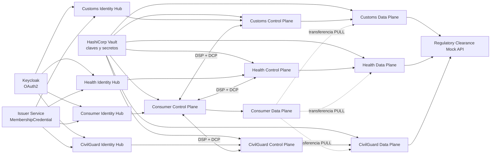

# Puerto Dataspace EDC

Prototipo de Espacio de Datos portuario construido con Eclipse Dataspace
Components (EDC), Dataspace Protocol (DSP) y Decentralized Claims Protocol
(DCP).

El escenario representa la autorización de retirada de un contenedor. Un
consumer consulta y combina información procedente de tres providers:

- **Customs**: autorización aduanera.
- **Health**: inspección sanitaria.
- **CivilGuard**: autorización de Guardia Civil.

El contenedor queda disponible para su retirada únicamente cuando los tres
providers responden con estado `CLEARED`.

## Arquitectura



Cada participante dispone de un Control Plane, un Data Plane y un Identity
Hub con PostgreSQL independiente. El Issuer Service emite una
`MembershipCredential` para cada participante. Durante catálogo y negociación,
DCP utiliza esas credenciales para autenticar y autorizar a las contrapartes.

### Participantes

| Participante | DID | Asset |
|---|---|---|
| Consumer | `did:web:consumer-identityhub%3A7083:consumer` | Consume y agrega los tres resultados |
| Customs | `did:web:provider-identityhub%3A8183:provider` | `asset-clearance-mscu7654321` |
| Health | `did:web:health-identityhub%3A8183:health` | `asset-health-clearance-mscu7654321` |
| CivilGuard | `did:web:civilguard-identityhub%3A8183:civilguard` | `asset-civilguard-clearance-mscu7654321` |
| Issuer | `did:web:issuer-service%3A10016:issuer` | Emite `MembershipCredential` |

### Puertos principales

| Stack | Identity Hub | Management API | DSP | Control API | Data Plane público | PostgreSQL |
|---|---:|---:|---:|---:|---:|---:|
| Consumer | `7280-7284` | `29193` | `29292` | `29194` | `29294` | `7433` |
| Customs | `7180-7184` | `19193` | `19292` | `19194` | `19294` | `7432` |
| Health | `7380-7384` | `21193` | `21292` | `21194` | `21294` | `7434` |
| CivilGuard | `7480-7484` | `22193` | `22292` | `22194` | `22294` | `7435` |

Otros servicios:

| Servicio | Puertos |
|---|---|
| Regulatory Clearance Mock API | `8081` |
| Keycloak | `8080` |
| HashiCorp Vault | `8200` |
| Issuer Service | `10010`, `10012`, `10013`, `10015`, `10016`, `9999` |
| Issuer PostgreSQL | `7444` |

La definición completa está en
[`docker-compose.edc.yml`](docker-compose.edc.yml).

## Requisitos

- Windows con Docker Desktop en ejecución.
- Windows PowerShell 5.1 o PowerShell 7.
- Puertos de la tabla anterior disponibles.
- Las siguientes imágenes locales:

  - `puerto-edc-controlplane:latest`
  - `puerto-edc-dataplane:latest`
  - `puerto-identityhub-mvd:latest`
  - `puerto-issuerservice-mvd:latest`

- Keycloak accesible en `http://localhost:8080`, con:

  - realm `logistics-dataspace`;
  - cliente de servicio `ih-provisioner`;
  - secreto `ih-provisioner-secret`;
  - participantes y scopes de Identity Hub provisionados.

- Vault accesible en `http://localhost:8200` con token de desarrollo `root` y
  los secretos STS de los participantes.
- Issuer Service provisionado con el participante `issuer`, los holders y la
  definición `membership-credential-def`.

El script crea las claves `private-key` y `public-key` del Transfer Proxy en
Vault cuando no existen. No crea el realm de Keycloak ni las imágenes
personalizadas.

Para comprobar rápidamente las dependencias:

```powershell
docker image inspect puerto-edc-controlplane:latest | Out-Null
docker image inspect puerto-edc-dataplane:latest | Out-Null
docker image inspect puerto-identityhub-mvd:latest | Out-Null
docker image inspect puerto-issuerservice-mvd:latest | Out-Null

Invoke-WebRequest -UseBasicParsing http://localhost:8200/v1/sys/health
Invoke-WebRequest -UseBasicParsing http://localhost:8080/realms/logistics-dataspace
```

## Arranque y validación completa

Desde la raíz del repositorio:

```powershell
powershell.exe -NoProfile -ExecutionPolicy Bypass -File .\start-edc-and-smoke-three-providers.ps1
```

Este es el comando principal del proyecto. El script
[`start-edc-and-smoke-three-providers.ps1`](start-edc-and-smoke-three-providers.ps1)
realiza automáticamente:

1. Arranque de PostgreSQL, Identity Hubs, Issuer Service y Mock API.
2. Espera activa hasta que los Identity Hubs estén disponibles.
3. Activación de los participantes.
4. Emisión de las `MembershipCredential` que falten.
5. Arranque o recreación de todos los Control Planes y Data Planes.
6. Provisión de las claves del Transfer Proxy en Vault.
7. Registro de assets, policies y contract definitions en los tres providers.
8. Comprobación de que los tres Data Planes están `AVAILABLE`.
9. Ejecución de
   [`smoke-test-three-providers.ps1`](smoke-test-three-providers.ps1).

El smoke test solicita los tres catálogos, negocia tres contratos, inicia tres
transferencias `HttpData-PULL`, descarga los datos y genera el resultado
agregado.

Una ejecución correcta termina con:

```text
OK: flujo multi-provider validado
ENTORNO MULTI-PROVIDER VALIDADO
```

El resultado esperado para los datos de demostración es:

```json
{
  "containerId": "MSCU7654321",
  "customsStatus": "CLEARED",
  "healthInspectionStatus": "CLEARED",
  "civilGuardStatus": "CLEARED",
  "overallStatus": "READY_FOR_PICKUP",
  "blockingAuthorities": []
}
```

## Resultados generados

Los artefactos de ejecución se escriben en `resources/generated/`:

- `catalog-*-response.json`: catálogos recibidos.
- `contract-negotiation-request-*.json`: solicitudes de negociación.
- `transfer-request-*.json`: solicitudes de transferencia.
- `edr-*-response.json`: Endpoint Data References.
- `downloaded-*-clearance.json`: datos descargados de cada provider.
- `aggregated-clearance-status.json`: resultado final consolidado.

## Tests unitarios

Los tests unitarios validan la lógica DCP sin necesidad de levantar Docker:

- extracción del scope `DataProcessorCredential`;
- combinación de scopes requeridos y existentes;
- aceptación de una `MembershipCredential` activa;
- rechazo de operadores, operands, fechas futuras, credenciales ausentes y
  claims malformados.

Para ejecutarlos en Windows:

```powershell
.\gradlew.bat test
```

En Linux o macOS:

```bash
./gradlew test
```

El workflow de GitHub Actions ejecuta estos tests antes del smoke test y
publica los informes HTML y JUnit como el artefacto `unit-test-reports`.

## Diagnóstico

Estado de los contenedores:

```powershell
docker compose -f .\docker-compose.edc.yml ps
```

Logs de un componente:

```powershell
docker logs consumer-controlplane --since 10m
docker logs health-controlplane --since 10m
docker logs civilguard-controlplane --since 10m
```

Ejecutar únicamente la validación, sin recrear el stack:

```powershell
powershell.exe -NoProfile -ExecutionPolicy Bypass -File .\smoke-test-three-providers.ps1
```

Detener los servicios definidos por el proyecto:

```powershell
docker compose -f .\docker-compose.edc.yml down
```

Este último comando no detiene Keycloak ni Vault cuando se ejecutan como
contenedores externos al Compose.
