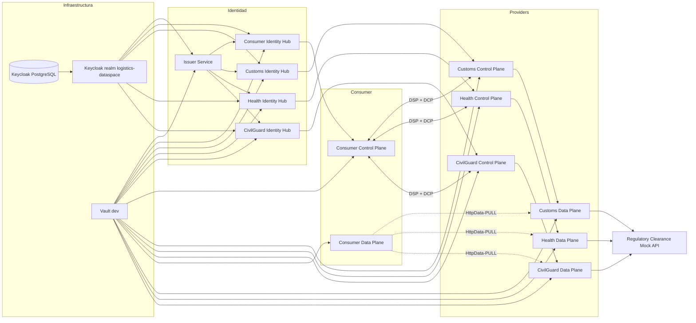
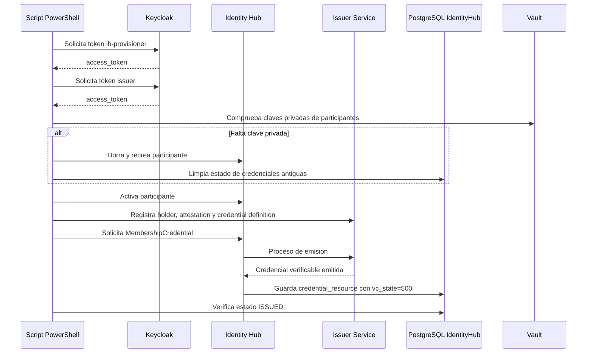
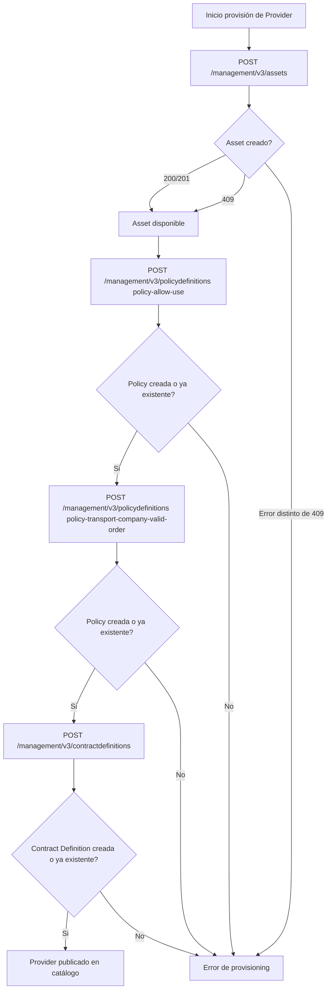
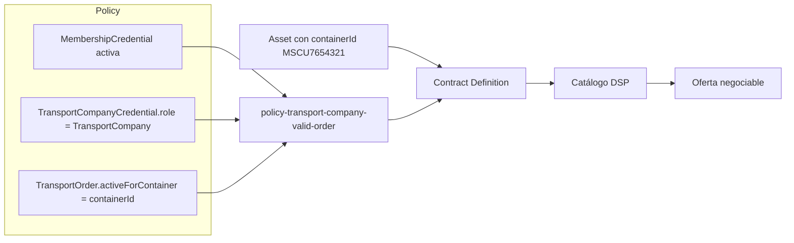
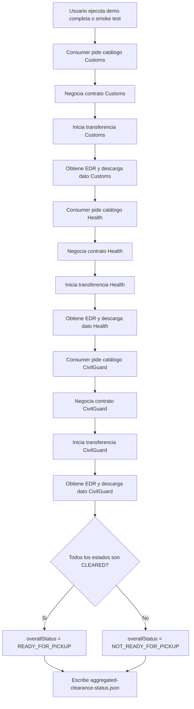
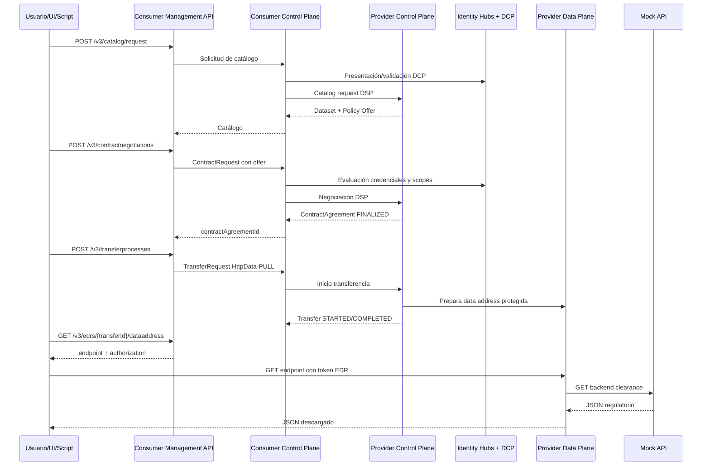
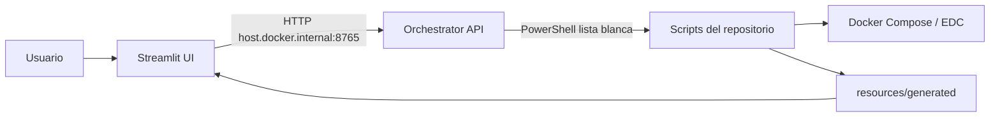
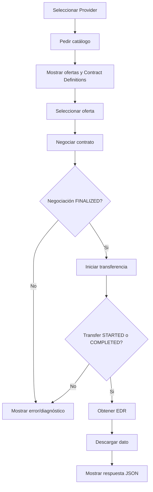
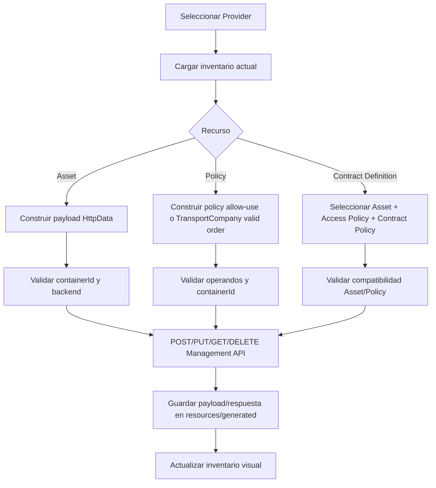

# Informe de arranque y funcionamiento de la aplicación Puerto Dataspace EDC

## 1. Objetivo del sistema

El proyecto implementa un prototipo de espacio de datos portuario basado en Eclipse Dataspace Components, Dataspace Protocol y Decentralized Claims Protocol. Su caso de uso principal es determinar si un contenedor puede retirarse del puerto combinando datos regulatorios publicados por tres autoridades:

- Customs: estado de autorización aduanera.
- Health: estado de inspección sanitaria.
- CivilGuard: autorización de Guardia Civil.

El Consumer representa a una empresa transportista. Para poder consumir los datos debe estar autenticado, ser miembro activo del dataspace, acreditar el rol `TransportCompany` y demostrar que tiene una orden de transporte activa para el contenedor solicitado.

El contenedor principal de la demo es:

```text
MSCU7654321
```

El resultado esperado, cuando los tres Providers responden `CLEARED`, es:

```json
{
  "containerId": "MSCU7654321",
  "customsStatus": "CLEARED",
  "healthInspectionStatus": "CLEARED",
  "civilGuardStatus": "CLEARED",
  "overallStatus": "READY_FOR_PICKUP",
  "blockingAuthorities": []
}
```

## 2. Componentes principales

El sistema se organiza en varios grupos de servicios Docker:

| Grupo | Componentes | Función |
|---|---|---|
| Infraestructura base | Keycloak, Keycloak PostgreSQL, Vault | Identidad OAuth2, realm de demo y almacenamiento de claves/secretos |
| Identidad descentralizada | Identity Hub de Consumer, Customs, Health y CivilGuard; Issuer Service | Gestión de participantes, DIDs, credenciales verificables y emisión de credenciales |
| EDC | Control Plane y Data Plane por participante | Catálogo, negociación contractual, transferencia y exposición controlada de datos |
| Datos de negocio | Mock API `regulatory-clearance-api` | Backend simulado con estados regulatorios y órdenes de transporte |
| Operación | UI Streamlit y API orquestadora | Ejecución visual de scripts, seguimiento de eventos y gestión manual/provisioning |

### 2.1 Participantes

| Participante | Rol | DID | Asset principal |
|---|---|---|---|
| Consumer | Empresa transportista consumidora | `did:web:consumer-identityhub%3A7083:consumer` | Agrega los datos de los tres Providers |
| Customs | Provider regulatorio | `did:web:provider-identityhub%3A8183:provider` | `asset-clearance-mscu7654321` |
| Health | Provider regulatorio | `did:web:health-identityhub%3A8183:health` | `asset-health-clearance-mscu7654321` |
| CivilGuard | Provider regulatorio | `did:web:civilguard-identityhub%3A8183:civilguard` | `asset-civilguard-clearance-mscu7654321` |
| Issuer | Emisor de credenciales | `did:web:issuer-service%3A10016:issuer` | Emite `MembershipCredential` y `TransportCompanyCredential` |

## 3. Arquitectura lógica



## 4. Modos de arranque

El repositorio ofrece tres formas principales de operar el sistema.

### 4.1 Modo servicio local

Comando:

```powershell
powershell.exe -NoProfile -ExecutionPolicy Bypass -File .\scripts\service-start.ps1
```

Este modo ejecuta:

```powershell
docker compose -f .\docker-compose.infra.yml -f .\docker-compose.edc.yml -f .\docker-compose.service.yml up -d --build
```

Levanta infraestructura, stack EDC y UI Streamlit. Es el modo mas cómodo para una demo visual. La UI queda disponible en `http://localhost:8501`, salvo que `.env` defina otro `UI_PORT`.

### 4.2 Arranque EDC sin smoke test

Comando:

```powershell
powershell.exe -NoProfile -ExecutionPolicy Bypass -File .\scripts\edc-start.ps1
```

Levanta los compose de infraestructura y EDC, crea `resources/generated` y escribe eventos UI en `resources/generated/ui-events.jsonl`. Es útil cuando se quiere dejar el entorno en marcha y luego operar manualmente desde la UI.

### 4.3 Arranque completo con validación multi-provider

Comando principal:

```powershell
powershell.exe -NoProfile -ExecutionPolicy Bypass -File .\start-edc-and-smoke-three-providers.ps1
```

Es el flujo más completo del proyecto. No solo arranca servicios, sino que también provisiona identidad, credenciales, Control Planes, Data Planes, assets, policies y contract definitions, y finalmente ejecuta un smoke test extremo a extremo.

## 5. Flujo de arranque completo

```mermaid
flowchart TD
    A[Inicio del script start-edc-and-smoke-three-providers.ps1] --> B[Crear resources/generated y reiniciar ui-events.jsonl]
    B --> C[Arrancar PostgreSQL de Identity Hubs e Issuer]
    C --> D[Arrancar o reconstruir Mock API]
    D --> E[Esperar PostgreSQL e inicializar esquema IdentityHub]
    E --> F[Arrancar Identity Hubs e Issuer Service]
    F --> G[Esperar readiness de Consumer IH, Provider IHs e Issuer]
    G --> H[Comprobar realm Keycloak logistics-dataspace]
    H --> I[Obtener tokens OAuth2: ih-provisioner e issuer]
    I --> J[Comprobar claves privadas en Vault]
    J --> K{Faltan claves?}
    K -- Sí --> L[Reprovisionar participantes y limpiar estado de credenciales]
    K -- No --> M[Activar participantes]
    L --> M
    M --> N[Registrar holders y definiciones en Issuer]
    N --> O[Emitir MembershipCredential para Consumer y Providers]
    O --> P[Emitir TransportCompanyCredential para Consumer]
    P --> Q[Construir imagen puerto-edc-controlplane:latest]
    Q --> R[Arrancar Control Planes y Data Planes]
    R --> S[Esperar readiness de Control/Data Planes]
    S --> T[Provisionar claves Transfer Proxy en Vault]
    T --> U[Registrar assets, policies y contract definitions]
    U --> V[Verificar Data Planes AVAILABLE]
    V --> W[Ejecutar smoke-test-three-providers.ps1]
    W --> X[Generar resultado agregado]
    X --> Y[ENTORNO MULTI-PROVIDER VALIDADO]
```



### 5.1 Eventos de UI

El script escribe eventos estructurados en:

```text
resources/generated/ui-events.jsonl
```

Cada evento contiene `timestamp`, `step`, `status`, `provider`, `message` y `data`. La UI Streamlit lee este fichero para mostrar progreso, estado global, estado por Provider, últimos mensajes y artefactos generados.

Estados usados:

- `RUNNING`: paso en ejecución.
- `SUCCESS`: paso completado.
- `ERROR`: paso fallido.
- `SKIPPED`: paso omitido, por ejemplo al ejecutar solo smoke test.
- `PENDING`: reservado para estado pendiente.

## 6. Funcionamiento de identidad y credenciales

El sistema usa Keycloak para obtener tokens OAuth2 de administración y DCP para acreditar identidad entre participantes durante catálogo, negociación y transferencia.

### 6.1 Tokens usados

| Token | Client | Uso |
|---|---|---|
| Provisioning Identity Hub | `ih-provisioner` | Activar participantes y solicitar credenciales desde Identity Hubs |
| Administración Issuer | `issuer` | Registrar holders, attestations y credential definitions en Issuer Service |

### 6.2 Credenciales emitidas

| Credencial | Holder | Finalidad |
|---|---|---|
| `MembershipCredential` | Consumer, Customs, Health, CivilGuard | Acredita pertenencia activa al dataspace |
| `TransportCompanyCredential` | Consumer | Acredita que el Consumer tiene rol `TransportCompany` |

### 6.3 Flujo de credenciales



La comprobación de éxito se hace consultando la tabla `credential_resource` y buscando credenciales en estado `vc_state=500`, que el script interpreta como emitidas.

## 7. Provisión de Assets, Policies y Contract Definitions

La provisión se realiza contra la Management API de cada Provider con API key `provider-api-key`.

| Provider | Management API | Asset | Contract Definition |
|---|---|---|---|
| Customs | `http://localhost:19193/management` | `asset-clearance-mscu7654321` | `contract-clearance-mscu7654321` |
| Health | `http://localhost:21193/management` | `asset-health-clearance-mscu7654321` | `contract-health-clearance-mscu7654321` |
| CivilGuard | `http://localhost:22193/management` | `asset-civilguard-clearance-mscu7654321` | `contract-civilguard-clearance-mscu7654321` |

El script registra, para cada Provider:

1. Asset.
2. Policy `policy-allow-use`.
3. Policy `policy-transport-company-valid-order`.
4. Contract Definition específica del Provider.

La función `Post-Json-Accept409` acepta respuestas `409 Conflict` como éxito funcional, porque significan que el recurso ya existía. Esto hace que el provisioning sea idempotente en ejecuciones repetidas.

### 7.1 Diagrama de provisión de artefactos



### 7.2 Assets

Los tres assets son de tipo `HttpData` y apuntan a la Mock API interna `regulatory-clearance-api:8081`.

| Asset | Endpoint backend | Categoría |
|---|---|---|
| `asset-clearance-mscu7654321` | `/containers/MSCU7654321/customs-clearance` | `ClearanceStatus` |
| `asset-health-clearance-mscu7654321` | `/containers/MSCU7654321/health-inspection` | `HealthInspectionStatus` |
| `asset-civilguard-clearance-mscu7654321` | `/containers/MSCU7654321/civilguard-clearance` | `CivilGuardStatus` |

Todos incluyen:

- `containerId = MSCU7654321`.
- `contenttype = application/json`.
- `useCase = Port Regulatory Clearance`.
- `proxyPath = true`.
- `proxyQueryParams = true`.
- `proxyBody = true`.
- `proxyMethod = true`.

Los flags de proxy permiten que el Data Plane gestione la petición de forma controlada y aplique la autorización EDR antes de llegar al backend.

### 7.3 Policies

#### `policy-allow-use`

Es una policy ODRL mínima con permiso de acción `use`. Sirve como ejemplo básico de permiso sin restricciones adicionales.

#### `policy-transport-company-valid-order`

Es la policy realmente usada por las Contract Definitions principales. Exige:

- Acción `use`.
- `TransportCompanyCredential.role == TransportCompany`.
- `TransportOrder.activeForContainer == ${containerId}`.

El valor `${containerId}` se resuelve a partir de las propiedades del Asset. Para la demo se convierte en `MSCU7654321`.

### 7.4 Contract Definitions

Cada Contract Definition usa:

- `accessPolicyId = policy-transport-company-valid-order`.
- `contractPolicyId = policy-transport-company-valid-order`.
- Un selector por ID exacto del asset.

Esto significa que el Provider solo publica el Asset en catálogo y permite su negociación si el Consumer cumple la policy de empresa transportista con orden activa para ese contenedor.



## 8. Flujo de caso de uso: retirada de contenedor

El caso de uso funcional se ejecuta en el smoke test. El Consumer consulta a los tres Providers, descarga los datos autorizados y calcula el estado final.



### 8.1 Secuencia DSP/DCP por Provider



## 9. Funcionamiento del smoke test multi-provider

El script `smoke-test-three-providers.ps1` define un array de Providers con:

- Nombre lógico.
- DID.
- Dirección DSP interna.
- Fichero de catalog request.
- Asset esperado.
- Base pública interna del Data Plane.
- Base local expuesta al host.
- Fichero de salida para el dato descargado.

Para cada Provider ejecuta la función `Invoke-ProviderFlow`:

1. Solicita catálogo con `POST /management/v3/catalog/request` en el Consumer.
2. Busca el dataset cuyo `@id` coincide con el asset esperado.
3. Extrae el offer id desde `odrl:hasPolicy.@id`.
4. Construye dinámicamente el `ContractRequest`, añadiendo `odrl:assigner` y `odrl:target`.
5. Lanza la negociación con `POST /management/v3/contractnegotiations`.
6. Consulta la negociación hasta estado `FINALIZED`.
7. Construye el `TransferRequest` con `transferType = HttpData-PULL`.
8. Lanza la transferencia con `POST /management/v3/transferprocesses`.
9. Consulta el transfer process hasta `STARTED` o `COMPLETED`.
10. Solicita el EDR con `GET /management/v3/edrs/{transferId}/dataaddress`.
11. Normaliza endpoints internos Docker a endpoints `localhost`.
12. Descarga el dato con el token EDR.
13. Devuelve el JSON descargado al agregador.

Finalmente, agrega:

- `customs.status`.
- `health.status`.
- `civilguard.status`.

Si cualquiera no es `CLEARED`, añade la autoridad correspondiente a `blockingAuthorities` y devuelve `NOT_READY_FOR_PICKUP`.

## 10. Artefactos generados

Durante la ejecución se escriben evidencias en `resources/generated/`.

| Artefacto | Descripción |
|---|---|
| `ui-events.jsonl` | Timeline estructurado para la UI |
| `catalog-*-response.json` | Catálogos devueltos por cada Provider |
| `contract-negotiation-request-*.json` | ContractRequests generados dinámicamente |
| `transfer-request-*.json` | TransferRequests generados dinámicamente |
| `edr-*-response.json` | Endpoint Data References de las transferencias |
| `downloaded-*-clearance.json` | Datos descargados desde los Providers |
| `aggregated-clearance-status.json` | Resultado consolidado final |
| `orchestrator-runs/*.json` | Metadatos de ejecuciones lanzadas por la API orquestadora |
| `orchestrator-runs/*.log` | Logs completos de esas ejecuciones |

## 11. UI Streamlit y API orquestadora

La UI proporciona una capa visual para operar el sistema. Puede ejecutarse en Docker junto al servicio o localmente.

### 11.1 Acciones principales de la UI

- Ejecutar demo completa.
- Arrancar EDC sin smoke.
- Ejecutar solo smoke test.
- Abrir flujo manual por Provider.
- Abrir provisioning de Provider.
- Ver artefactos generados, EDRs, datos descargados y resultado agregado.
- Consultar timeline de eventos y estado por Provider.

### 11.2 API orquestadora

Cuando la UI corre dentro de Docker no debe ejecutar comandos arbitrarios del host ni montar el Docker socket. Para resolverlo existe `orchestrator_api/main.py`, una API FastAPI local que expone una lista blanca de comandos:

| Comando | Script |
|---|---|
| `service_start` | `scripts/service-start.ps1` |
| `service_stop` | `scripts/service-stop.ps1` |
| `edc_start` | `scripts/edc-start.ps1` |
| `demo_full` | `start-edc-and-smoke-three-providers.ps1` |
| `smoke_only` | `smoke-test-three-providers.ps1` |

Endpoints relevantes:

- `GET /health`.
- `GET /commands`.
- `POST /commands/{command_name}/run`.
- `GET /runs`.
- `GET /runs/{run_id}`.
- `GET /runs/{run_id}/log`.
- `POST /runs/{run_id}/stop`.

La API guarda logs y metadatos en `resources/generated/orchestrator-runs/` y bloquea ejecuciones solapadas devolviendo `409` si ya hay un proceso en marcha.



## 12. Flujo manual por Provider

La página `ui/pages/1_Manual_Provider_Flow.py` permite ejecutar de forma guiada el flujo para un Provider concreto:



Esta pantalla resulta útil para demostrar y diagnosticar el protocolo paso a paso: catálogo, oferta, negociación, transferencia, EDR y descarga.

## 13. Provisioning manual de Provider

La página `ui/pages/2_Provider_Provisioning.py` permite crear, consultar, actualizar y borrar:

- Assets.
- Policies.
- Contract Definitions.

También valida coherencia entre:

- `containerId` del Asset.
- `containerId` exigido por la Contract Policy.
- Endpoint backend configurado.
- Contract Definition seleccionada.

Flujo conceptual:



Las actualizaciones de Assets y Contract Definitions usan `PUT`. Para Policies, la UI usa `DELETE + POST` porque el endpoint de EDC no expone `PUT` para policy definitions; después recrea las Contract Definitions asociadas cuando corresponde.

## 14. Puertos y endpoints principales

| Servicio | URL o puerto |
|---|---|
| UI Streamlit | `http://localhost:8501` |
| API orquestadora | `http://localhost:8765` |
| Keycloak | `http://localhost:8080` |
| Vault | `http://localhost:8200` |
| Mock API | `http://localhost:8081` |
| Consumer Management API | `http://localhost:29193/management` |
| Customs Management API | `http://localhost:19193/management` |
| Health Management API | `http://localhost:21193/management` |
| CivilGuard Management API | `http://localhost:22193/management` |
| Consumer Data Plane público | `http://localhost:29294` |
| Customs Data Plane público | `http://localhost:19294` |
| Health Data Plane público | `http://localhost:21294` |
| CivilGuard Data Plane público | `http://localhost:22294` |

## 15. Criterios de éxito

El sistema se considera correctamente arrancado y validado cuando:

1. `start-edc-and-smoke-three-providers.ps1` termina sin excepciones.
2. La salida muestra `OK: flujo multi-provider validado`.
3. La salida muestra `ENTORNO MULTI-PROVIDER VALIDADO`.
4. Existe `resources/generated/aggregated-clearance-status.json`.
5. `overallStatus` vale `READY_FOR_PICKUP`.
6. Los tres ficheros `downloaded-*-clearance.json` existen y contienen `status = CLEARED`.

## 16. Diagnóstico rápido

### 16.1 Ver estado del servicio

```powershell
powershell.exe -NoProfile -ExecutionPolicy Bypass -File .\scripts\service-status.ps1
```

### 16.2 Ver logs de un contenedor

```powershell
powershell.exe -NoProfile -ExecutionPolicy Bypass -File .\scripts\service-logs.ps1 consumer-controlplane
```

### 16.3 Ejecutar solo validación sin reprovisionar todo

```powershell
powershell.exe -NoProfile -ExecutionPolicy Bypass -File .\smoke-test-three-providers.ps1
```

### 16.4 Parar sin borrar volumenes

```powershell
powershell.exe -NoProfile -ExecutionPolicy Bypass -File .\scripts\service-stop.ps1
```

No debe usarse `docker compose down -v` salvo que se quiera borrar explícitamente el estado persistido.

## 17. Riesgos y consideraciones

- El entorno está pensado para demo local, no para producción.
- Vault esta en modo desarrollo y usa token `root`.
- Keycloak usa realm, clients y secrets de demostración.
- Los participantes se ejecutan en la misma máquina.
- Los endpoints están publicados en `localhost`.
- La Mock API sintetiza datos de demo para contenedores válidos no precargados.
- La seguridad real requeriría HTTPS, secretos externalizados, rotación de claves, DIDs públicos reales, segmentación de red y control de exposición de puertos.

## 18. Resumen operativo

El arranque completo prepara primero la capa de infraestructura e identidad, después garantiza que todos los participantes tengan claves y credenciales válidas, a continuación levanta Control Planes y Data Planes, publica los recursos de los Providers y finalmente ejecuta una validación real del flujo DSP/DCP.

El punto clave del sistema es que la publicación de datos no depende solo de que exista un endpoint HTTP: el Consumer debe pasar por catálogo, negociación contractual, evaluación de policies, emisión de EDR y descarga autorizada. La autorización combina credenciales verificables y reglas de negocio sobre el contenedor, de forma que el dato solo se entrega cuando el participante consumidor es miembro del dataspace, tiene rol de empresa transportista y posee una orden activa para `MSCU7654321`.
